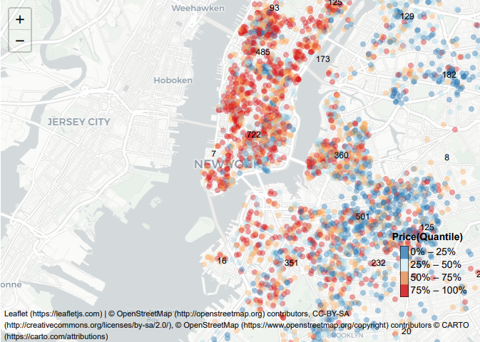
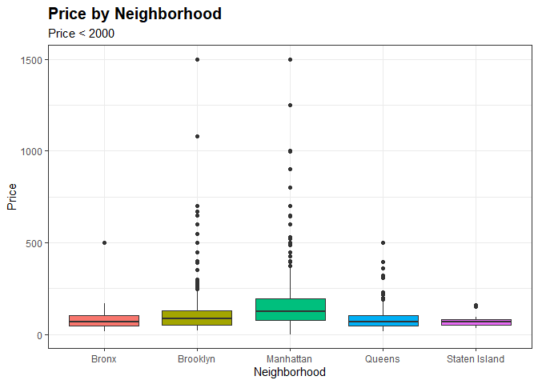
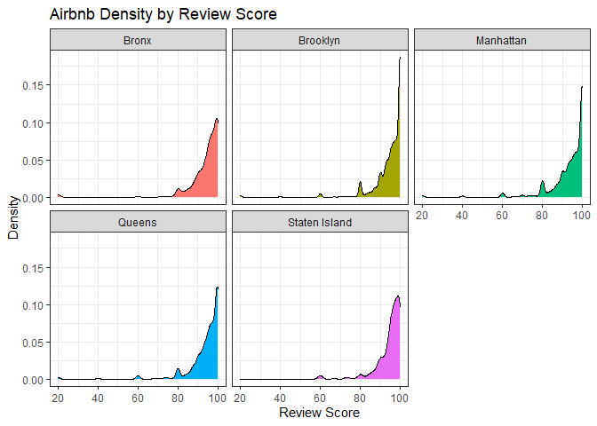
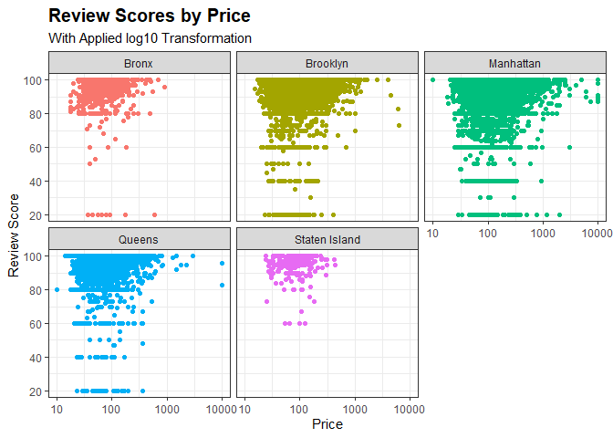
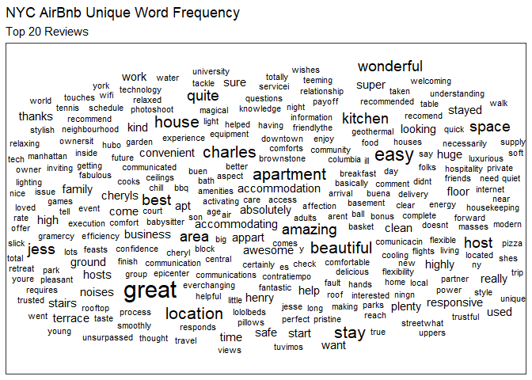
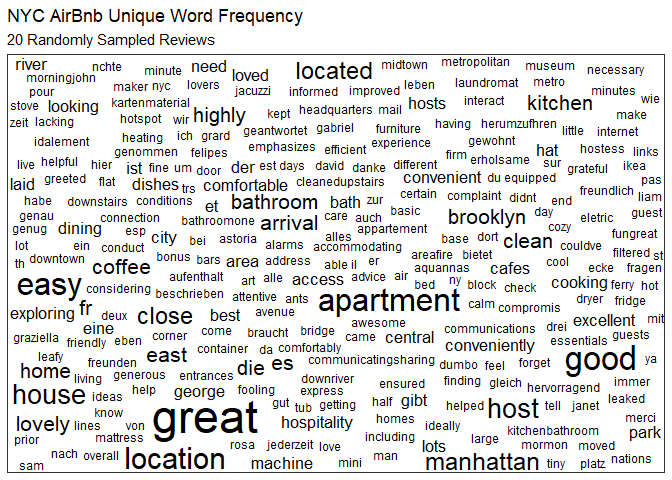
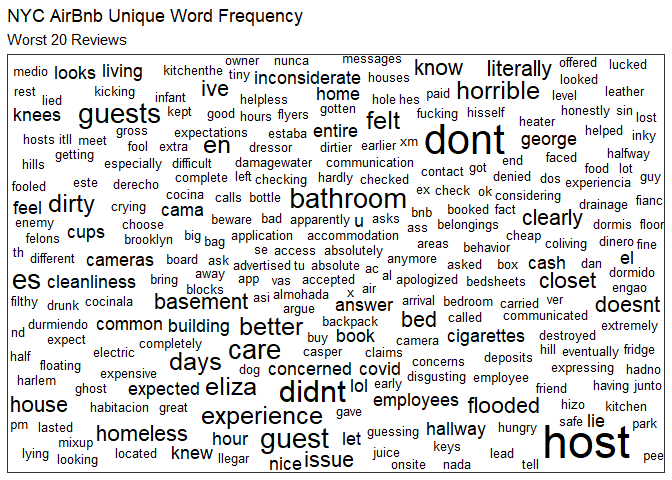
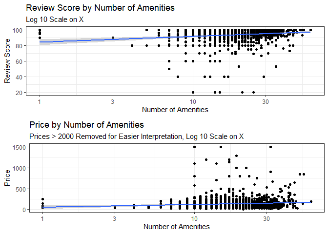

AirBNB Data Analysis
================
Tim Harrold, Madison Brown, Yifei Hao
3/10/2021

-   [Introduction](#introduction)
-   [Data Visualization](#data-visualization)
    -   [Mapped Listings by Price](#mapped-listings-by-price)
    -   [Box Plot of Price](#box-plot-of-price)
    -   [Density by Price](#density-by-price)
    -   [Review Scores by Price](#review-scores-by-price)
    -   [Stop Words](#stop-words)
    -   [Reviews Word Analysis](#reviews-word-analysis)
    -   [Amenities by Price and Score](#amenities-by-price-and-score)
-   [Machine Learning](#machine-learning)
    -   [Multiple Regression](#multiple-regression)
    -   [Regression Tree](#regression-tree)
    -   [Model Tree](#model-tree)
    -   [Conclusions](#conclusions)
    -   [Limitations](#limitations)

*NOTE: There will be a PDF and HTML document submitted for this project.
The PDF contains everything significant in the report, but the HTML file
will allow you to use the interactive leaflet.*

# Introduction

Our data was sourced from Airbnb’s website:
<http://insideairbnb.com/get-the-data.html>

In this analysis we will be observing qualitative and quantitative
characteristics to discover the variation in Airbnbs throughout New York
City, and what makes the best Airbnb experience. We ask the question,
which characteristics are correlated with a better reported experience?

This analysis will include graphs to show the relationships between
price and neighborhood, rating and neighborhood, rating and number of
reviews, and rating and review stop words. We will be using tables,
density plots, scatter plots, and maps to analyze the correlations
between these variables. To give a qualitative analysis of peoples
stays, we will be using word cloud to filter keywords from the reviews.
A map of the city will provide spacial information on where the most vs
least expensive Airbnbs are located in the city.

We don’t believe in any sampling bias by Airbnb in this observational
‘study’, as this data is from an objective database of ALL airbnb
listings. These listings included metadata that we’re pulling from, such
as price, reviews, and location. However, it is possible that the
qualitative elements such as amenities may be biased, as these are up to
the property owners to create. Some owners may oversell their listing.
This bias hopefully will be overcome by the reviews of said listing.
Analyzing more objective attributes may provide a clearer understanding
of each property’s offerings.

There was a lot of data cleaning done to produce this data over many
iterations. A private github repo / git log of all commits can be
produced upon request. Some methods include:

-   Scrubbing language of all punctuation and non-alphanumeric
    characters using regular expressions
-   Counting and analyzing attribute metadata such as length
-   Counting and analyzing pertinent words and phrases
-   Taking and modifying a random sample of data to lower computational
    cost while providing meaningful accuracy
-   Removing extraneous values from graphs for easier interpretation

This data is interesting because it is real. AirBNB is becoming a more
viable alternative to hotels or motels because they are cheaper, cozier,
and closer to the city experience than a hotel. Each experience is
unique, making it hard to know exactly what a good AirBNB looks like.
Finding these qualities can make your next vacation better, and expedite
research on making good plans.

# Data Visualization

## Mapped Listings by Price

*Here, we tried to utilize ggmaps and ggplot before resorting to leaflet
for our map. We tried mapping the review scores, which didn’t quite
display right. Most scores are very high, even when mapping 68% of the
data within one standard deviation of the mean.*

*The other challenge was taking a small enough subset of the data to map
without crashing a computer(three computer crashes were involved in the
making of this report). Leaflet offers multiple coloring methods, such
as numerical, bin-based, and quantile-based. Quantiles ended up working
especially well for this map.*

We hypothesized that the Bronx and Brooklyn would have a higher
concentration of lower priced Airbnbs than Staten Island and Manhattan.
Our hypothesis is only partially correct. Brooklyn has a similar
distribution to Staten Island, and Queens has a similar distribution to
the Bronx. Our hypothesis was supported in the case of the Bronx and
Manhattan.

This map also has some interesting findings in the density of
properties, and their price. The listings get much more dense the
further into Manhattan you go, second to Queens and Brooklyn.
Interestingly, price also increases as you get into these areas. As per
our earlier findings, Manhattan and Brooklyn are the most expensive
boroughs to stay in.

Within Manhattan, values get more dense and more expensive towards the
south end. This is the financial district of NYC, where most skyscrapers
and businesses are. Perhaps people with financial interests, or
wealthier individuals like Wall Street bankers stay in pricier AirBNB’s.
SoHo and Greenwich Village are also in this part of Manhattan, which
must be more expensive.

When people visit NYC, they want to be closer to the center of the city.
They likely pay more for staying in or near Manhattan - where most
tourist attractions are. To be cliche, the saying is ‘Location,
Location, Location’ in real estate.

<!-- -->

## Box Plot of Price

This Box Plot offers an alternate view of Price from the map above. It
is able to demonstrate the statistics for each borough while the map is
case specific. While the map shows the viewer a physical representation
of price, the box plot provides statistics for the viewer to analyze and
compare across boroughs. The graph shows many outliers that may add a
bias or skew the data. In Brooklyn and Manhattan especially, the data
has a lot of points that are far above average. This could mean that
analysis of this data may not reflect the average experience, but rather
a small subset of very pricey listings.

<!-- -->

## Density by Price

This graph shows the density of Airbnbs with different review scores
within the five boroughs. We hypothesized that the Bronx and Brooklyn
would have the higher densities of lower reviewed Airbnbs than Staten
Island and Manhattan. Our hypothesis is only partially correct. Brooklyn
has a similar distribution to Manhattan. There are more Airbnbs in these
boroughs with very high ratings than there are in the other boroughs.
Our hypothesis was supported in the case of the Bronx, queens, and
Staten Island. The distribution of ratings is similar among these
boroughs. Manhattan and Brooklyn are more expensive and desirable
boroughs for living and tourism. This not only increases the price, but
may also affect quality. The quality of Airbnbs among the boroughs is
likely reflected in the review scores.

\*We attempted to arrange the facet\_wrap into one column to make
reading the graphs and comparing the boroughs easier. This stretched out
each graph and did not help with readability. It is easiest to read
facet\_wrap with three columns.

<!-- -->

## Review Scores by Price

This graph shows the review score by price of Airbnbs in each borough.
We hypothesized that there would be a positive correlation between price
and review score. The data show that higher priced Airbnbs tend to have
high review scores. Most of the multithousand dollar Airbnbs do not have
review scores below 80. Although more expensive Airbnbs trend towards
higher scores, this does not mean that cheaper Airbnbs trend towards
lower scores. The Airbnbs with the lower scores tend to be the cheaper
ones; However, less expensive Airbnbs also have high scores. From this,
we conclude that price has less impact on cheaper Airbnb review scores
than expensive ones.

\*scale\_x\_log10() was used to make the graphs more readable.

<!-- -->

## Stop Words

For this part of the analysis, we will take 20 listings from the top and
bottom of the data, then sample another 20 randomly. We will then filter
these through a list of stop words(deemed irrelevant to the data) to
find relevant and unique words to describe these experiences.

## Reviews Word Analysis

The first correlation we noticed is the use of more abstract words
against the expreience of each airbnb. When a place is better, words
like “great”, “easy”, “flexible”, and “confidence” are used. The finding
here is that a better experience may not be distinct in what makes it
amazing, but rather there is a lack of inconvenience. It seems that
people also value communication and accessibility in their AirBNB
experience. “resposive”, “accommodating”, and many names are listed in
these reviews. Perhaps there was a personal element to the stays that
added to the experience. It is also worth noting that this is the only
word cloud that easily fit into its box - people have a lot less to say
when they are satisfied than when they are upset.

Average reviews were somewhere in the middle, where “clean”,
“available”, and “comfortable” showed up often. These aren’t generally
descriptive of an exceptional experience, and moreso meet the baseline
of a good AirBNB. Accessibility is still mentioned with “access”,
“communication”, and “easy”. Less names are mentioned in this data, but
they are still present. Some people may have had better experiences when
more names were mentioned. “Apartment” showed up more than any other
word, as was the case with the top 20 graph. In New York City,
apartments likely make up most properties. An average stay would
probably be in an apartment(although some were in bungalows,
apparently).

In our worst experiences, lots of red flags immediately come up.
“Felons”, “Smell”, and “Homeless” are evidently bad. The learning here
is the usage of less abstract words and more nouns. It seems specific
things were present, and people have a lot to say about specific aspects
of their stay. “Bathroom”, “Room”, “Water”, “Basement” and “Smoke”
showed up often - these things must contribute to negative experiences.
People do not mention accessibility OR names, meaning the owners may not
even be present for the experience. Where the best and average stays
mentioned apartments, the worst experiences are “places”.

Some interesting anomalies in the bad experiences include “sin”,
“knees”, “cameras”, “ghost”, and “pathological” - one can easily imagine
a bad scenario with these words.

<!-- --><!-- --><!-- -->

## Amenities by Price and Score

One characteristic outside of the price and review score we want to
consider is the amenities offered by each Airbnb. As with the other
graphs, it seems there isn’t much of a correlation between the number of
amenities and price or quality. The range of 15-40 amenities generally
hold the bulk of the data, meaning that good Airbnb’s generally have
these many amenities. Some higher listings have upwards of 60 amenities,
but it doesn’t seem to make them much better than any of the other
listings. A reason for this could be that the property owners have
different ideas of what amenities mean, so the upper quantiles may have
amenities like ‘hot tubs’ or ‘lofts’ while lower ones may have
‘bathrooms’ or ‘bedrooms’. In further reports, diving deeper into the
amenities themselves could provide a clearer picture of what makes an
Airbnb better. The same case can be made with price - there is a
diminishing return, but most listings fall within the 15-40 range for
amenities.

<!-- -->

# Machine Learning

For Machine Learning, we decided to use 7 variables (accuracy,
cleanliness, check-in, communication, location, value, and price) to try
to explain the review score. The variables, other than price, are
customers’ separate ratings of Airbnb in these aspects. For example, 10
for location means the customer is satisfied with the location of that
Airbnb. Also, the data we used included only Airbnb prices under $1,000.

``` r
scores <- listings %>% select("review_scores_rating", "review_scores_accuracy", "review_scores_cleanliness", "review_scores_checkin", "review_scores_communication", "review_scores_location", "review_scores_value", "priceNum")

names(scores) <- c('Score', 'accuracy', 'cleanliness', 'checkin', 'communication', 'location', 'value', 'price')

scores <- scores %>% drop_na() %>% filter(price <= 1000)

summary(scores)
```

    ##      Score           accuracy       cleanliness        checkin      
    ##  Min.   : 20.00   Min.   : 2.000   Min.   : 2.000   Min.   : 2.000  
    ##  1st Qu.: 92.00   1st Qu.: 9.000   1st Qu.: 9.000   1st Qu.:10.000  
    ##  Median : 97.00   Median :10.000   Median :10.000   Median :10.000  
    ##  Mean   : 93.78   Mean   : 9.588   Mean   : 9.269   Mean   : 9.722  
    ##  3rd Qu.:100.00   3rd Qu.:10.000   3rd Qu.:10.000   3rd Qu.:10.000  
    ##  Max.   :100.00   Max.   :10.000   Max.   :10.000   Max.   :10.000  
    ##  communication       location          value            price       
    ##  Min.   : 2.000   Min.   : 2.000   Min.   : 2.000   Min.   :  10.0  
    ##  1st Qu.:10.000   1st Qu.: 9.000   1st Qu.: 9.000   1st Qu.:  60.0  
    ##  Median :10.000   Median :10.000   Median :10.000   Median :  98.0  
    ##  Mean   : 9.714   Mean   : 9.599   Mean   : 9.368   Mean   : 124.2  
    ##  3rd Qu.:10.000   3rd Qu.:10.000   3rd Qu.:10.000   3rd Qu.: 150.0  
    ##  Max.   :10.000   Max.   :10.000   Max.   :10.000   Max.   :1000.0

``` r
# pairs.panels(scores)
```

## Multiple Regression

We first used a multiple regression to make the prediction for the
entire data set. The correlation of prediction and true value is 0.89,
which is pretty high correlation. We can also tell from the plot that
they do have a positive correlation. The mean average error (MAE) of the
prediction is about 2.74. Since the total score is 100, a 2.74 margin of
error is not very high. From the multiple regression, we got **Score =
-5.47 + 2.3 accuracy + 2.2 cleanliness + 0.86 checkin + 1.92
communication + 0.35 location + 2.77 value + 0.0025 price** If customers
are satisfied with Airbnb’s cleanliness, communication, geographical
location and other aspects, they will also be satisfied with the room
overall.

``` r
score_lm <- lm(Score ~ . , data = scores)
score_lm
```

    ## 
    ## Call:
    ## lm(formula = Score ~ ., data = scores)
    ## 
    ## Coefficients:
    ##   (Intercept)       accuracy    cleanliness        checkin  communication  
    ##     -5.472186       2.303251       2.201207       0.864935       1.921510  
    ##      location          value          price  
    ##      0.353237       2.774853       0.002461

``` r
summary(score_lm)
```

    ## 
    ## Call:
    ## lm(formula = Score ~ ., data = scores)
    ## 
    ## Residuals:
    ##     Min      1Q  Median      3Q     Max 
    ## -59.528  -1.625   0.485   1.420  60.107 
    ## 
    ## Coefficients:
    ##                 Estimate Std. Error t value Pr(>|t|)    
    ## (Intercept)   -5.4721857  0.3791736 -14.432   <2e-16 ***
    ## accuracy       2.3032506  0.0477119  48.274   <2e-16 ***
    ## cleanliness    2.2012067  0.0325014  67.727   <2e-16 ***
    ## checkin        0.8649348  0.0491338  17.604   <2e-16 ***
    ## communication  1.9215101  0.0493925  38.903   <2e-16 ***
    ## location       0.3532370  0.0412528   8.563   <2e-16 ***
    ## value          2.7748534  0.0428438  64.767   <2e-16 ***
    ## price          0.0024614  0.0002577   9.553   <2e-16 ***
    ## ---
    ## Signif. codes:  0 '***' 0.001 '**' 0.01 '*' 0.05 '.' 0.1 ' ' 1
    ## 
    ## Residual standard error: 4.342 on 26612 degrees of freedom
    ## Multiple R-squared:  0.7931, Adjusted R-squared:  0.793 
    ## F-statistic: 1.457e+04 on 7 and 26612 DF,  p-value: < 2.2e-16

``` r
pred1 <- predict(score_lm, scores)
cor(pred1, scores$Score)
```

    ## [1] 0.8905597

``` r
plot(pred1, scores$Score)
abline(a = 0, b = 1, col = "red", lwd = 3, lty = 2)
```

<!-- -->

``` r
MAE <- function(actual, predicted) {
  mean(abs(actual - predicted))  
}

mae_model <- MAE(pred1, scores$Score)
mae_model
```

    ## [1] 2.737263

``` r
mae_mean <- MAE(93.78, scores$Score)
mae_mean
```

    ## [1] 5.899779

``` r
mae_mean - mae_model
```

    ## [1] 3.162516

## Regression Tree

For Regression tree, we took 16620 observations as training data, and
10000 observations as testing data. From the plot, we can tell: - If the
value for Airbnb is less than 7.5, and the accuracy is less than 4.5,
then it would get a review score about *29.8*. - If the value for Airbnb
is less than 7.5, the accuracy is greater than or equal to 4.5, and the
communication is less than 6.5, then it would get a review score about
*56.3*. - If the value for Airbnb is less than 7.5, the accuracy is
greater than or equal to 4.5, and the communication is greater than or
equal to 6.5, then it would get a review score about *72.9*. - If the
value for Airbnb is greater than or equal to 7.5 and less than 8.5, and
the accuracy is less than 9.5, then it would get a review score about
*82.7*. - If the value for Airbnb is greater than or equal to 8.5, and
the accuracy is less than 9.5, then it would get a review score about
*90.8*. - If the value for Airbnb is greater than or equal to 7.5, the
accuracy is greater than or equal to 9.5, and the cleanliness is less
than 9.5, then it would get a review score about *94.4*. - If the value
for Airbnb is greater than or equal to 8, the accuracy is greater than
or equal to 9.5, and the cleanliness is greater than or equal to 9.5,
then it would get a highest review score *98*.

The mean average error (MAE) of the prediction is about 3.32.

``` r
RNGversion('3.5.3')
set.seed(111)
train_sample <- sample(1:26620, 16620)

head(train_sample, 10)
```

    ##  [1] 15786 19339  9860 13706 10052 11135   284 14166 11501  2493

``` r
train <- scores[train_sample, ]
test <- scores[-train_sample, ]

reg_tree <- rpart(Score ~. , data = train)
reg_tree
```

    ## n= 16620 
    ## 
    ## node), split, n, deviance, yval
    ##       * denotes terminal node
    ## 
    ##  1) root 16620 1548910.00 93.75120  
    ##    2) value< 7.5 617  284382.50 61.88979  
    ##      4) accuracy< 4.5 115   26796.52 29.82609 *
    ##      5) accuracy>=4.5 502  112272.30 69.23506  
    ##       10) communication< 6.5 110   22993.86 56.31818 *
    ##       11) communication>=6.5 392   65775.28 72.85969 *
    ##    3) value>=7.5 16003  614031.40 94.97963  
    ##      6) accuracy< 9.5 3957  216217.20 89.10993  
    ##       12) value< 8.5 832   60730.88 82.69952 *
    ##       13) value>=8.5 3125  112193.90 90.81664 *
    ##      7) accuracy>=9.5 12046  216698.50 96.90777  
    ##       14) cleanliness< 9.5 3719  103385.70 94.36273 *
    ##       15) cleanliness>=9.5 8327   78465.56 98.04443 *

``` r
rpart.plot(reg_tree, digits = 3,
           fallen.leaves = TRUE,
           type = 4, extra = 101,
           box.palette = 'RdBu',
           shadow.col = 'gray')
```

<!-- -->

``` r
pred2 <- predict(reg_tree, test)

summary(pred2)
```

    ##    Min. 1st Qu.  Median    Mean 3rd Qu.    Max. 
    ##   29.83   90.82   94.36   93.85   98.04   98.04

``` r
summary(test$Score)
```

    ##    Min. 1st Qu.  Median    Mean 3rd Qu.    Max. 
    ##   20.00   92.00   97.00   93.83  100.00  100.00

``` r
cor(pred2, test$Score)
```

    ## [1] 0.8224621

``` r
MAE(pred2, test$Score)
```

    ## [1] 3.319609

## Model Tree

For the model tree, we used the same training and testing data and got
22 rules. The correlation is 0.88 and the MAE is 2.64 which is the
smallest MAE of the three models.

``` r
model_tree <- cubist(x = train[-1],
                     y = train$Score)
summary(model_tree)
```

    ## 
    ## Call:
    ## cubist.default(x = train[-1], y = train$Score)
    ## 
    ## 
    ## Cubist [Release 2.07 GPL Edition]  Wed May 19 16:05:40 2021
    ## ---------------------------------
    ## 
    ##     Target attribute `outcome'
    ## 
    ## Read 16620 cases (8 attributes) from undefined.data
    ## 
    ## Model:
    ## 
    ##   Rule 1: [430 cases, mean 58.3, range 20 to 100, est err 7.8]
    ## 
    ##     if
    ##  cleanliness <= 6
    ##  value <= 8
    ##     then
    ##  outcome = -1.1 + 3.04 cleanliness + 2.98 value + 2.3 accuracy
    ##            + 2 communication
    ## 
    ##   Rule 2: [30 cases, mean 71.0, range 20 to 100, est err 17.2]
    ## 
    ##     if
    ##  accuracy <= 7
    ##  cleanliness <= 8
    ##  value > 8
    ##     then
    ##  outcome = 18.4 + 4.03 cleanliness + 4.9 accuracy
    ## 
    ##   Rule 3: [1002 cases, mean 80.4, range 20 to 100, est err 5.0]
    ## 
    ##     if
    ##  accuracy <= 9
    ##  cleanliness > 6
    ##  value <= 8
    ##     then
    ##  outcome = -7.8 + 4.77 value + 2.3 accuracy + 1.7 cleanliness
    ##            + 2.2 communication
    ## 
    ##   Rule 4: [80 cases, mean 83.9, range 60 to 100, est err 7.1]
    ## 
    ##     if
    ##  accuracy > 7
    ##  cleanliness <= 8
    ##  communication <= 8
    ##  value > 8
    ##     then
    ##  outcome = -34 + 5.84 value + 5.03 cleanliness + 1.9 checkin
    ##            + 0.4 communication + 0.3 accuracy + 0.2 location
    ##            + 0.0011 price
    ## 
    ##   Rule 5: [55 cases, mean 86.7, range 60 to 100, est err 9.8]
    ## 
    ##     if
    ##  accuracy > 7
    ##  cleanliness <= 6
    ##  communication > 8
    ##  value > 9
    ##  price <= 255
    ##     then
    ##  outcome = 33.3 + 3.3 accuracy + 1.53 cleanliness + 0.0075 price
    ##            + 0.9 checkin + 0.12 value
    ## 
    ##   Rule 6: [155 cases, mean 87.2, range 40 to 100, est err 7.7]
    ## 
    ##     if
    ##  accuracy > 9
    ##  cleanliness > 6
    ##  communication <= 8
    ##     then
    ##  outcome = 13.4 + 6.63 value + 1.7 checkin
    ## 
    ##   Rule 7: [127 cases, mean 88.5, range 60 to 100, est err 6.3]
    ## 
    ##     if
    ##  cleanliness > 8
    ##  communication <= 8
    ##  value > 8
    ##     then
    ##  outcome = -17.1 + 5.21 value + 3 accuracy + 2.4 communication
    ##            + 0.66 cleanliness + 0.3 checkin + 0.2 location
    ## 
    ##   Rule 8: [2001 cases, mean 90.8, range 60 to 100, est err 3.1]
    ## 
    ##     if
    ##  accuracy > 8
    ##  checkin <= 9
    ##  communication > 8
    ##     then
    ##  outcome = 5.3 + 2.11 cleanliness + 2.11 value + 1.9 accuracy
    ##            + 1.8 communication + 0.7 checkin + 0.7 location
    ##            + 0.0018 price
    ## 
    ##   Rule 9: [135 cases, mean 91.0, range 70 to 100, est err 5.3]
    ## 
    ##     if
    ##  accuracy <= 8
    ##  cleanliness > 8
    ##  communication > 8
    ##  value > 8
    ##     then
    ##  outcome = 6.8 + 2.92 value + 2.5 cleanliness + 1.7 checkin
    ##            + 0.8 accuracy + 0.8 communication + 0.3 location
    ## 
    ##   Rule 10: [344 cases, mean 92.7, range 60 to 100, est err 6.5]
    ## 
    ##     if
    ##  accuracy > 9
    ##  cleanliness > 6
    ##  communication > 8
    ##  value <= 8
    ##     then
    ##  outcome = -13.6 + 2.79 cleanliness + 3.7 communication + 2.84 value
    ##            + 1.5 checkin + 0.9 location + 0.2 accuracy
    ## 
    ##   Rule 11: [5252 cases, mean 92.8, range 67 to 100, est err 2.5]
    ## 
    ##     if
    ##  communication > 8
    ##  value > 8
    ##  value <= 9
    ##     then
    ##  outcome = 11.9 + 2.43 cleanliness + 2 accuracy + 1.38 value
    ##            + 1.2 communication + 0.9 location + 0.7 checkin
    ##            + 0.0025 price
    ## 
    ##   Rule 12: [33 cases, mean 93.0, range 80 to 100, est err 6.0]
    ## 
    ##     if
    ##  cleanliness <= 8
    ##  value > 9
    ##  price > 255
    ##     then
    ##  outcome = -14.6 + 7.68 cleanliness + 4.6 checkin + 0.0135 price
    ## 
    ##   Rule 13: [127 cases, mean 93.5, range 60 to 100, est err 8.5]
    ## 
    ##     if
    ##  accuracy <= 8
    ##  cleanliness > 6
    ##  value > 9
    ##     then
    ##  outcome = 24.5 + 2.37 cleanliness + 1.8 accuracy + 1.6 value
    ##            + 1.2 communication + 1.1 checkin + 0.3 location
    ##            + 0.0014 price
    ## 
    ##   Rule 14: [290 cases, mean 94.1, range 70 to 100, est err 3.6]
    ## 
    ##     if
    ##  accuracy > 8
    ##  cleanliness > 9
    ##  checkin > 9
    ##  communication <= 9
    ##  location > 8
    ##     then
    ##  outcome = 59.5 + 2 accuracy + 1.47 value + 0.2 communication
    ## 
    ##   Rule 15: [282 cases, mean 94.1, range 80 to 100, est err 2.8]
    ## 
    ##     if
    ##  accuracy > 8
    ##  cleanliness > 8
    ##  communication > 8
    ##  location <= 8
    ##  value > 8
    ##     then
    ##  outcome = -6.7 + 4.09 value + 3.3 accuracy + 1.72 cleanliness
    ##            + 1 checkin + 0.4 communication + 0.2 location
    ## 
    ##   Rule 16: [387 cases, mean 94.1, range 70 to 100, est err 5.3]
    ## 
    ##     if
    ##  accuracy > 8
    ##  cleanliness > 6
    ##  cleanliness <= 8
    ##  communication > 8
    ##  value > 9
    ##  price <= 199
    ##     then
    ##  outcome = 6.5 + 3.25 cleanliness + 2.4 accuracy + 1.9 checkin
    ##            + 1.42 value + 0.0104 price + 0.5 communication + 0.3 location
    ## 
    ##   Rule 17: [3598 cases, mean 94.3, range 70 to 100, est err 2.3]
    ## 
    ##     if
    ##  accuracy > 8
    ##  cleanliness > 8
    ##  cleanliness <= 9
    ##  checkin > 9
    ##     then
    ##  outcome = 28.2 + 2.12 value + 2.2 accuracy + 1.8 communication
    ##            + 0.6 location + 0.003 price + 0.12 cleanliness
    ## 
    ##   Rule 18: [1334 cases, mean 96.2, range 80 to 100, est err 2.2]
    ## 
    ##     if
    ##  cleanliness > 9
    ##  checkin > 9
    ##  communication > 9
    ##  value > 8
    ##  value <= 9
    ##     then
    ##  outcome = 60.8 + 2.2 accuracy + 0.7 location + 0.27 value + 0.0026 price
    ##            + 0.23 cleanliness + 0.2 communication
    ## 
    ##   Rule 19: [1121 cases, mean 98.1, range 80 to 100, est err 1.6]
    ## 
    ##     if
    ##  accuracy > 8
    ##  cleanliness > 9
    ##  checkin > 9
    ##  communication > 9
    ##  location > 8
    ##  value > 8
    ##  price <= 52
    ##     then
    ##  outcome = 40.5 + 2.6 accuracy + 1.78 value - 0.0125 price + 1.6 location
    ## 
    ##   Rule 20: [5177 cases, mean 98.5, range 80 to 100, est err 1.4]
    ## 
    ##     if
    ##  accuracy > 8
    ##  cleanliness > 9
    ##  communication > 9
    ##  location > 8
    ##  value > 9
    ##  price > 52
    ##  price <= 258
    ##     then
    ##  outcome = 71.7 + 1.2 accuracy + 1.2 location + 0.0016 price + 0.16 value
    ##            + 0.14 cleanliness + 0.1 communication
    ## 
    ##   Rule 21: [5562 cases, mean 98.6, range 80 to 100, est err 1.3]
    ## 
    ##     if
    ##  cleanliness > 9
    ##  checkin > 9
    ##  communication > 9
    ##  location > 8
    ##  value > 9
    ##  price > 52
    ##     then
    ##  outcome = 82.9 + 1.2 location + 0.4 accuracy + 0.11 value
    ## 
    ##   Rule 22: [28 cases, mean 98.7, range 90 to 100, est err 1.6]
    ## 
    ##     if
    ##  cleanliness > 6
    ##  cleanliness <= 8
    ##  value > 9
    ##  price > 199
    ##  price <= 255
    ##     then
    ##  outcome = 81.7 + 1.03 cleanliness + 0.0048 price + 0.5 checkin
    ##            + 0.4 accuracy
    ## 
    ## 
    ## Evaluation on training data (16620 cases):
    ## 
    ##     Average  |error|                2.9
    ##     Relative |error|               0.50
    ##     Correlation coefficient        0.86
    ## 
    ## 
    ##  Attribute usage:
    ##    Conds  Model
    ## 
    ##     81%    75%    communication
    ##     78%   100%    value
    ##     74%    74%    cleanliness
    ##     54%    99%    accuracy
    ##     50%    33%    checkin
    ##     45%    93%    location
    ##     45%    70%    price
    ## 
    ## 
    ## Time: 1.5 secs

``` r
pred_tree <- predict(model_tree, test)

summary(pred_tree)
```

    ##    Min. 1st Qu.  Median    Mean 3rd Qu.    Max. 
    ##   19.54   92.61   96.81   94.59   99.91  100.14

``` r
summary(test$Score)
```

    ##    Min. 1st Qu.  Median    Mean 3rd Qu.    Max. 
    ##   20.00   92.00   97.00   93.83  100.00  100.00

``` r
cor(pred_tree, test$Score)
```

    ## [1] 0.8808969

``` r
MAE(test$Score, pred_tree)
```

    ## [1] 2.642214

## Conclusions

New York City has a lot to do, and a lot of unique experiences per
neighborhood and borough. We believe that some while some neighborhoods
may not be as highly rated as others, the price you pay for an Airbnb is
generally a good way to ensure a decent experience. Our qualitative
analysis shows some diminishing return - meaning there is a point where
spending more money will not make a better experience. An illustrative
fact is that all five boroughs have a high average review score, yet the
price increases significantly closer to Manhattan and Brooklyn. Of
course, correlation and causation are not the same. Paying more for an
Airbnb is NOT the reason it is good. Amenities usually have something to
do with quality, meaning a good Airbnb usually has a decent amount of
them.

Because people generally use Airbnbs as a base for their vacation, we
believe the biggest determinant in a good experience is communication.
Most people simply want an owner that makes it easy to get in, drop
their luggage and see the city. Worse AirBNB experiences usually come
from necessities not being met - such as a dirty apartment or illegal
happenings in or around the Airbnb. While people having a good
experience often focus on things such as cleanliness and extra features,
people with a bad experience notice the poor communication the most, and
lack thereof.

The key points of this report point to location, accessibility, and
communication.

If these basic needs are met at a baseline, we believe that a positive
review and score will be given. A good Airbnb experience is a simple,
accommodating apartment in a decent location - one that is not dirty or
haunted.

## Limitations

This data was very thorough, expansive and full of opportunities for
analysis. While some great conclusions were found, the size of the data
presented a limitation. Several parts of the data were not
computationally feasible for all 37k+ listings, so random samples that
may not have been representative were taken. This study does not utilize
many variables to find what correlates with positive reviews, such as
bed count or particular accommodations. In the future, one could use
more variables to see what neighborhoods or conditions make for a better
experience. One could also analyze each neighborhood or borough
independently. Manhattan may have has another ‘level’ of experience than
the Bronx, so to speak. This is to say that a good Airbnb in the Bronx
might be subpar in Manhattan. Analyzing what makes the experience better
by neighborhood could be more individualized, as it could be based on
different goals and variables. Finally, the number of amenities is not a
qualitative analysis. Some owners may list basic necessities as
amenities, while some random amenities may add more to the review score.
Diving into these would surely give a better analysis.

In the future, more machine learning could be applied to this analysis.
A decision tree with multiple trials could be used to compare attributes
or amenities, and to classify review scores as ‘good’, ‘bad’, or
‘average’. This will give direction to what other attributes should be
analyzed and reported on.
